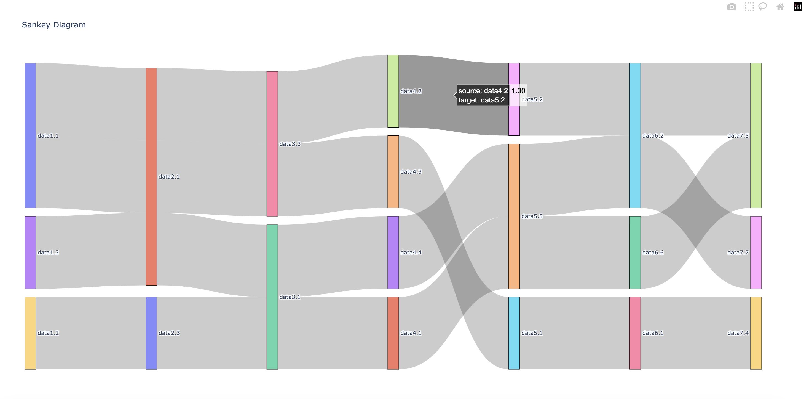

# Description

Python script to convert multi-column CSV file into Sankey Diagram.

In cases when in a CSV file a row represents a flow from left to right
in a multi-column convention, this script helps with the conversion of
that file into an intermediate file that then will be used to generate
the required Sankey Diagram.


# Requirements

- Python 3.12.2

## Activate the environment:

```bash
# virtual environments from pyenv
pyenv install 3.12.2
pyenv virtualenv 3.12.2 csv_visualization
pyenv activate csv_visualization
pyenv deactivate csv_visualization
# You can also use `pyenv local`
```

## Install requirements:

```bash
pip install -r requirements.txt
```

## Install new package

```bash
pip install <package>
```

## Update `requirements.txt`

```bash
pip freeze > requirements.txt
```

## Run script

```bash
python csv_to_sankey_diagram_visualisation.py data.csv
```

### To see options available

```bash
python csv_to_sankey_diagram_visualisation.py -h
```

# Usage

```bash
python csv_to_sankey_diagram_visualisation.py <input_csv_file>
```

## Script options (`-h` or `--help`)
```bash
python csv_to_sankey_diagram_visualisation.py -h
```

## Examples

```bash
python csv_to_sankey_diagram_visualisation.py examples/more_layers_data.csv
```

With [`examples/more_layers_data.csv`](examples/more_layers_data.csv) as input you'll get something like this:




# Resources:
- [How to create Sankey Diagrams from DataFrames in Python](https://medium.com/kenlok/how-to-create-sankey-diagrams-from-dataframes-in-python-e221c1b4d6b0)
- [Sankey diagram in Python](https://medium.com/@sssspppp/sankey-diagram-in-python-10c377f1099f)
- [How to create a Sankey diagram in 30 seconds with Python (step-by-step guide)](https://www.fabi.ai/blog/how-to-create-a-sankey-diagram-in-30-seconds-with-python)
- [Basic Sankey Diagram with pysankey](https://python-graph-gallery.com/basic-sankey-diagram-with-pysankey/)
